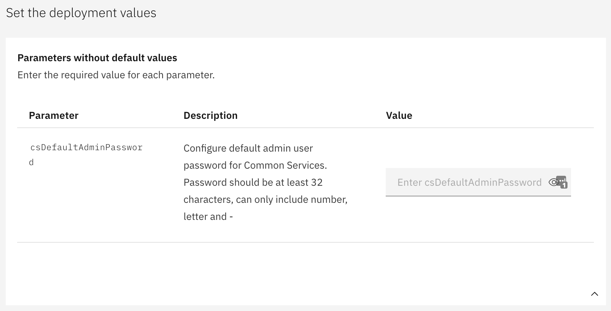

# Setting up Cloud Pak for Integration on IBM Cloud
### 1. Get sizing information

We will be deploying CP4I on OpenShift cluster. CP4I instance will have App Connect and API Connect capabilities added to it. So the amount of resources required for CP4I, with the capabilities mentioned, installation will be huge. Let's get that information before we get to provisioning OpenShift cluster.

- Login to your IBM Cloud account. On the dashboard, click on `Catalog`. Search for `Cloud Pak for Integration` and click on the `Cloud Pak for Integration` tile as shown in below image.

  

Under `Configure your installation environment`, make a note of the minimum requirements. Note that this is just a bare minimum requirement for CP4I instance. But since we will be adding ACE and APIC, we'll see what additional requirements are needed. Click on `Readme` tab.

For each of the additional capabilities, requirements are specified. However for us we do not need to calculate individual requirements. We have an option with all required components. Scroll down, in configuration section, notice the `demoPreparation` configuration. We will be using this configuration to install CP4I. Make a note of additional requirements for this configuration in description. 

Following table shows total minimum requirement:

|                          |  Cores  |Memory (GB)|Disk Space (GB) |
| -------------------------|:-------:|:---------:|:-------------: |
| ICP4I minimum requirement|    8    |    32     |      25        |
| Demo preparation         |  61.05  |   120.5   |     569.8      |
| Total                    |**69.05**| **152.5** |   **594.8**    |

### 2. Provision OpenShift Cluster on IBM Cloud

Now, that we have the requirements, we will create an instance of OpenShift Cluster on IBM Cloud. 

> Note that OpenShift cluster on IBM Cloud is charged. Before submitting the request to create OpenShift instance, you will be shown the cost. 

- Navigate to IBM Cloud dashboard. Click on `Catalog` and search for `OpenShift`. And click on `Red Hat OpenShift on IBM Cloud` tile.

  

  

- Choose the latest version of OpenShift

  

  

- Under `OCP entitlement` select the one appropriate for you. Applying entitlement will not charge you with license cost but the hourly/monthly charges will anyway be charged.

  

  

- Select `Geography`, `Availability` and `Worker zone`. For this task, we have selected as shown in below image. Refer this [link](https://cloud.ibm.com/docs/containers?topic=containers-planning_worker_nodes) for details on various options available.

  

  

- Scroll down a bit and you will see `Worker pool` section.

  - Here we need to select how many nodes we want and what will be the configuration of each node.
  - From the minimum requirement calculated above, we need 69.05 cores, 152.5 GB Memory and 594.8 GB of disk space. In this example, we select 5 nodes, each having about 16 vCPUs, 32 GB of Memory and 125 GB of disk space, which will add up to be more than sufficient for our requirement. 
  - 
  - Click on `Change Flavor` and select an entry with `16 vCPUs 32 GB RAM` and click on `Done`.
  - Change `Worker nodes per data center` to 5.
  - Leave rest of the options to default values.

- On the right side of the screen, `Estimated monthly cost` is shown. Be sure to verify that you are fine with it before proceeding.

  

- Click on `Create` button to create this cluster. The cluster creation takes about 30 minutes. 

- To check the status of cluster, navigate to your IBM Cloud dashboard and click on `Clusters`. Verify the `Status` of the cluster you created is `Normal`.

### 3. Setting up Cloud Pak for Integration

We will be installing CP4I instance on Red Hat OpenShift cluster on IBM Cloud. We will use the cluster created in previous steps. 

- Navigate to your IBM Cloud dashboard. On the dashboard, click on `Catalog`. Search for `Cloud Pak for Integration` and click on the `Cloud Pak for Integration` tile as shown in below image.

  

- Under `Red Hat OpenShift cluster` select the cluster name that you created in previous steps.

- Under `Project` enter the project to create as `integration`. 

- Under `Configure your workspace` make a note of the `Name`. This will be your workspace name. You can change it, if you like.

- Under `Complete the preinstallation`, click `Run Script`. The script takes a few seconds to complete.

- When the installation script run completes, scroll down to `Set the deployment values` section. Enter a value for `csDefaultAdminPassword`. Make a note of the password you entered.

  

- Expand `Parameters with default value` by clicking the down arrow mark.

  

- Scroll a little down and you will see the parameter `demoPreparation`. Change the default value from false to `true`. 

- Update `DemoAPICEmailAddress`, `DemoAPICMailServerUsername`, and `DemoAPICMailServerPassword` to any appropriate values. Email address can be any arbitrary email in a valid format, like, sample@example.com.

- On the right hand side of the window, checkmark the license agreement and click `Install`. 

- The installation of CP4I, with ACE and APIC, will take about an hour or so. 

- When the installation is complete, go to your IBM Cloud dashboard and click `Schematics workspaces`

  

- Scroll down to the `Schematics workspaces` section and verify that the CP4I instance that your created is listed here and is in `Active` status

  

This completes your CP4I installation on IBM Cloud.

