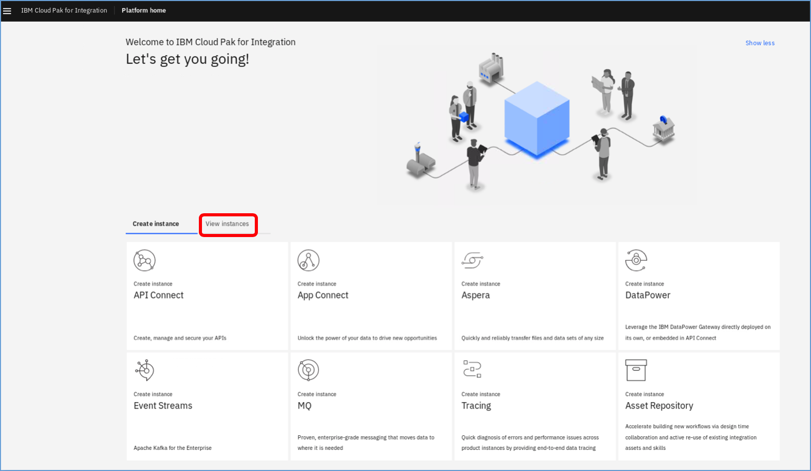
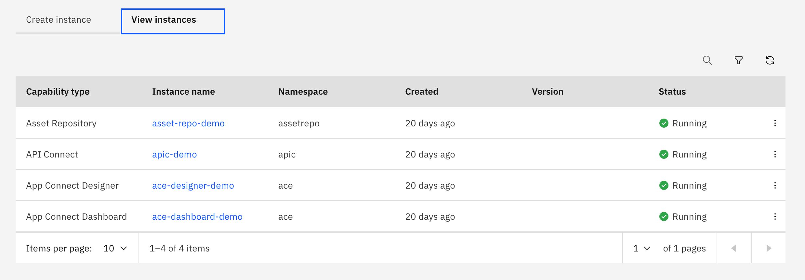
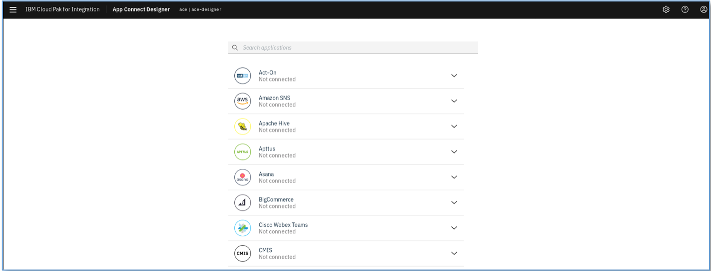
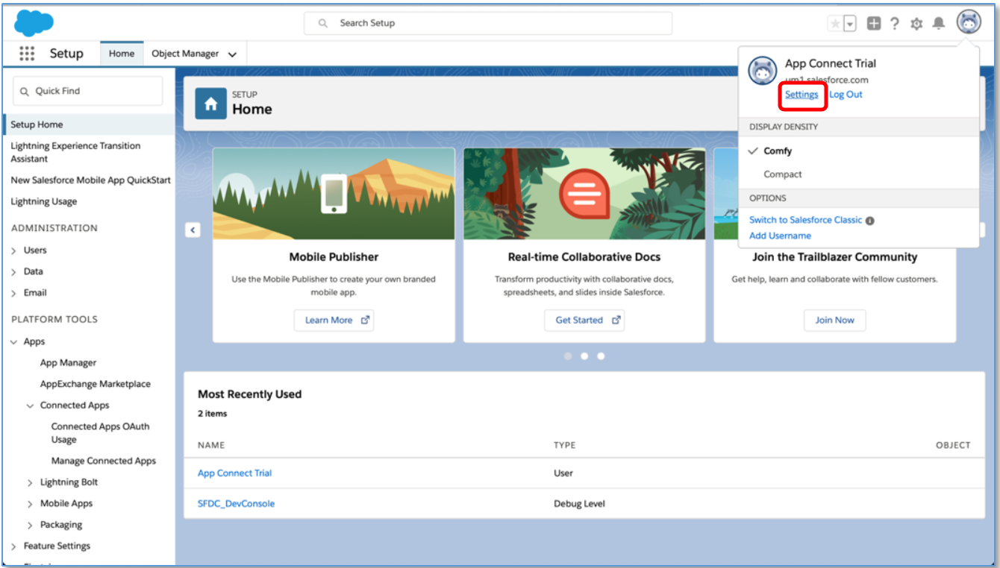
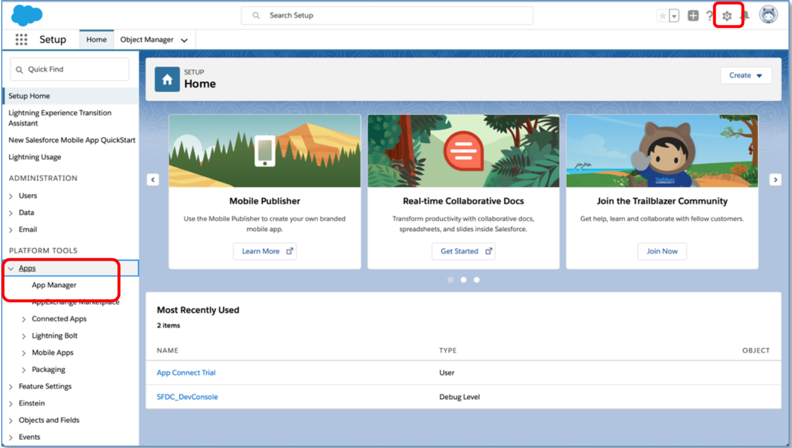
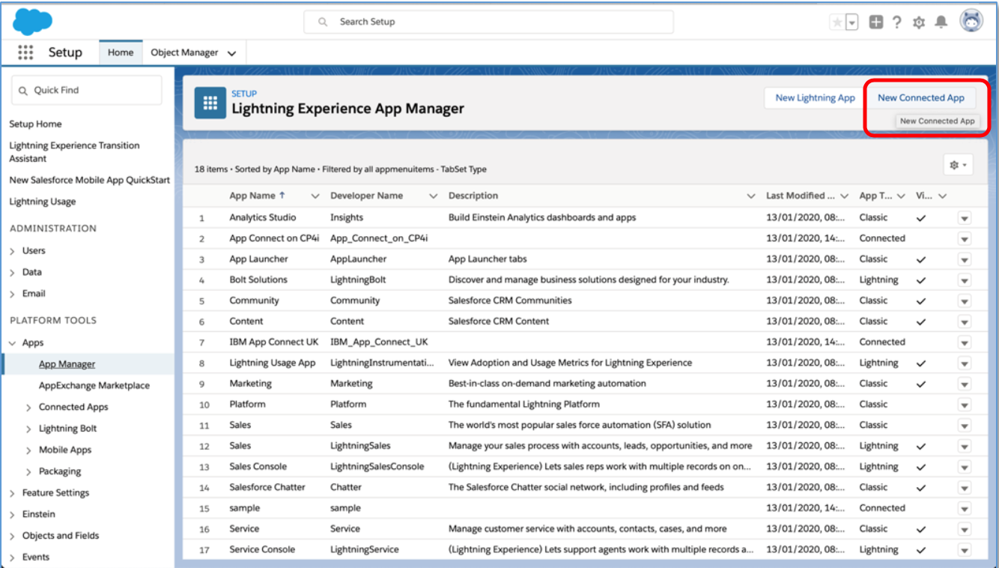
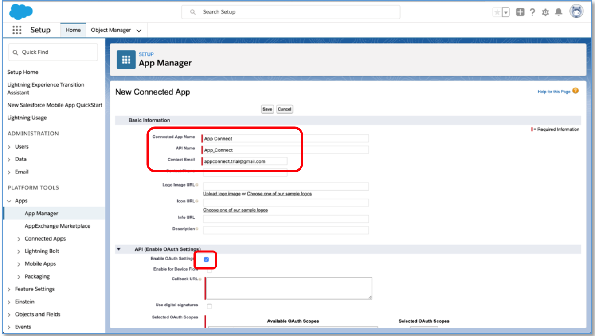
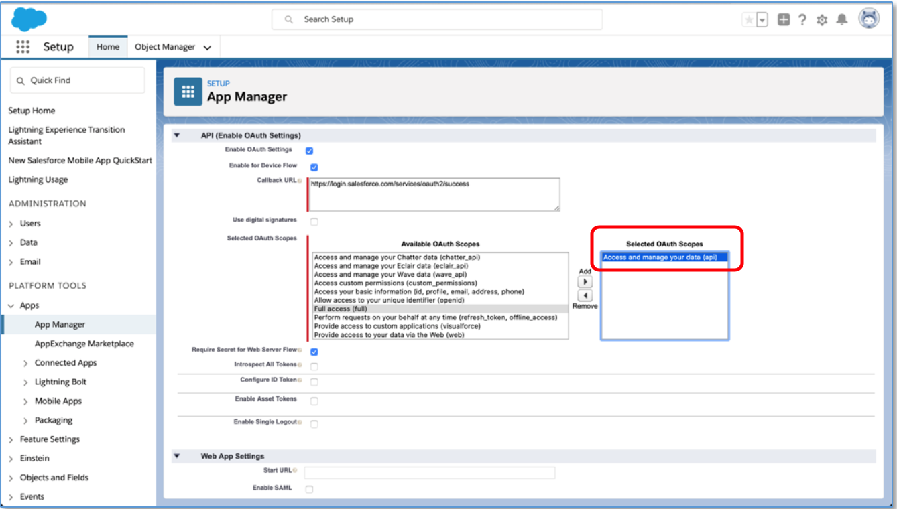
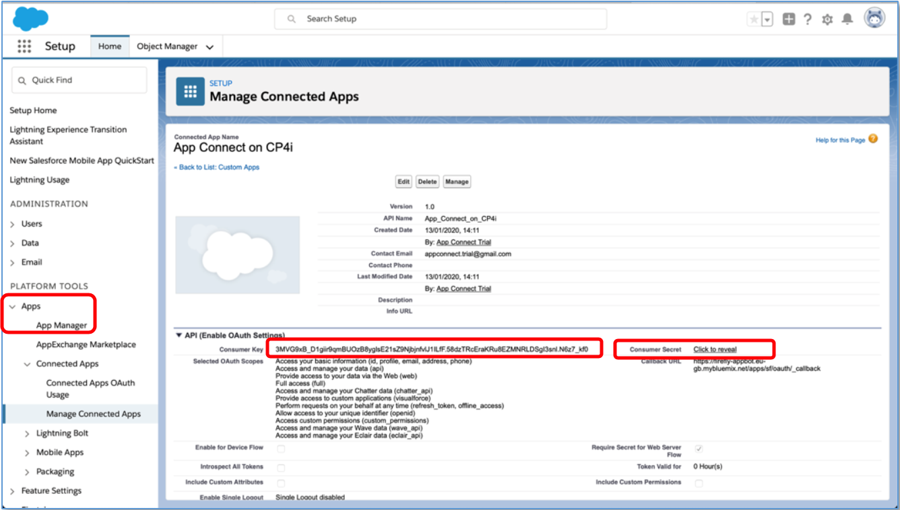
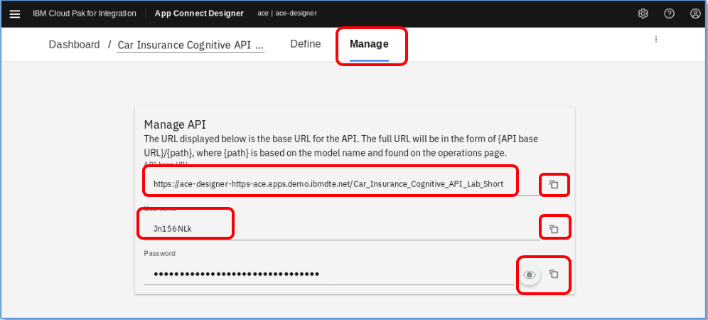

# Build a Cognitive Car Claim Processing application with CP4I Integration capabilities
### Work-in-progress

Every enterprise in today's markets must offer robust digital products and services, often requiring integration of complex capabilities and systems to deliver one coherent whole. [IBM Cloud Pak for Integration](https://cloud.ibm.com/docs/cloud-pak-integration?topic=cloud-pak-integration-getting-started) offers a simplified solution to this integration challenge, allowing the enterprise to modernize its processes while positioning itself for future innovation. Once installed, IBM Cloud Pak for Integration eases monitoring, maintenance and upgrades, helping the enterprise stay ahead of the innovation curve.

In this Code Pattern will Integration Designer to create an API which takes a car repair claim request, complete with a photograph of the car, and integrates with a SaaS CRM system and IBM’s Watson AI to create a car repair case with all the correct details loaded into the SaaS system. and data routed to the correct location based on the image contents; all in a few seconds before returning a response to the customer.

As an ‘extension’ we check if the car is a convertible/roadster.

 If it is, we translate the request into Spanish for our Spanish-speaking partner and create an incident their ServiceNow SaaS system, complete with car photograph.

Due to time constraints, the ‘extension’ will only be briefly described – we will ensure we build an end-to-end managed API before discussing the extended scenario.

Business Scenario:

- We are a Car Repair company: We take in vehicles with problems and repair them – seems simple but..

  - We want to gain business advantage by allowing multiple car leasing companies to use us to repair their cars – these companies insist that we expose APIs for them to call to do business with them.
  
  - We want to allow their customers to book their cars in for repair and get an estimate for price and number of days in real time – in seconds. Later we will build more APIs to allow customers to query the status of their repairs, or make updates or add comments to their repair cases.
  
  - We want to allow them to send photos of their cars so we can check for type, damage etc.
  
- We want to check for errors and issues up-front as quickly as possible to feed back to the customer in real time. Photo not valid? No car in the photo? We’ll tell you instantly so you can re-submit.
  
  - We want to minimize manual processes and have the repair request automatically create a repair case in our CRM system (Salesforce). If a customer wants to book a repair at 3am on a Sunday, they can – it’s their choice.
  
  - We are wanting to grow our business fast with this new model and expect the use of APIs to really increase the number of requests we get. We need our solution to be scalable and highly available.
  
    
  
  


# Architecture


# Flow

1. User sends car repair request to API (API Connect)
2. User request is forwarded to integration flow
3. Use IBM Watson Visual Recognition to analyze the photo. If it is not a valid picture, Watson will return an error immediately to the user calling the API. Check that Watson can ‘see’ a car in the picture – if not, we will immediately respond back with an error saying ‘There is no car in this picture’ so the error can be corrected immediately.
4. Create a `Case` in Salesforce with the data from the API. This Case is where we store the details and progress of our repair. Also, add an attachment of the photograph to Salesforce so that we have the image stored in our system.
5. Analyze the description of the problem as described by the customer using IBM Watson Tone Analysis. We store this in Salesforce for future reference – if the customer is angry or upset, we may wish to take further action or treat them more carefully.
6. This is an extended scenario, wherein if the car is a specialist car (identified by Visual Recognition Service) it is sent to partner for repair. The partner speaks Spanish and and we'll use IBM Watson language translator to translate our request into Spanish before we send it to them
7. This is an extended scenario as well. Partner uses ServiceNow, not Salesforce so we need to create an incident in their ServiceNow system – automatically
8. Send a response back to the customer with their Salesforce case reference for future enquiries and also an estimate of how long it will take to repair and how much it will cost.


# Watch the Video

[](https://www.youtube.com/watch?v=TRzO26kawu4)


We will achieve the above objectives in two parts as follows:

Part1 - In part1, this Code Pattern, we will build and deploy our integration application using App Connect in CP4I. 

Part2 - In part2, we will expose the integration application APIs using API management feature of CP4I. [Use API Management capabilities of ICP4i to expose APIs to the wider world in a controlled manner]()


# Steps

1. Plan of Work
   1. Set up our integration systems and services endpoints
   2. Create an integration flow for our ‘Car Repair Claim API’
   3. Deploy the API to the Cloud Pak for Integration (ICP4i) runtime
2. List of things we will need:
   1. List of Systems and Services Endpoints
      1. Salesforce:
      2. IBM Watson – Visual Recognition:
      3. IBM Watson – Tone Analysis:
      4. ServiceNow:
      5. IBM Watson – Language Translation:
   2. IBM Cloud Pak for Integration (ICP4i) Capability list:
      1. Application Integration (IBM App Connect):
      2. Smart Connectors
      3. API Management (IBM API Connect)
   3. Some extra things we need for this series:
      1. An email server and client
      2. GitHub
      3. IBM API Connect Toolkit
3. Getting Started – Setting up the endpoints
   1. Setting up IBM Watson Services
      1. Logging in to IBM Cloud
      2. Creating your free Lite-Plan IBM Watson Services:
   2. Setting up SalesForce
4. Getting into the Cloud Pak and Building Your Integration
   1. Getting into SkyTap and the VMs
   2. Accessing ICP4i
   3. Accessing the Designer Integration Tooling
   4. Connecting the tooling to our endpoints
   5. Setting up the Salesforce Connection
   6. Importing the Integration flow into designer
   7. Reviewing our API Integration Flow:
      1. Receive the Customer’s car repair request with photograph via an API
      2. Use IBM Watson Visual Recognition to analyse the photo.
      3. Check that Watson can ‘see’ a car in the picture
      4. If not, we will immediately respond back with an error saying ‘There is no car in this picture’
      5. Create a ‘Case’ in Salesforce with the data from the API.
      6. Add the photograph to our Salesforce case so we have it stored.
      7. Analyse the description of the problem as described by the customer using IBM Watson Tone Analysis.
      8. Send a response back to the customer with their Salesforce case reference
   8. Starting the flow:
5. Testing our API Integration Flow
   1. API Base path
   2. APIKey / Client ID
   3. UserID and Password
6. How we will test the APIs
   1. $cp4ibasepath
   2. $cp4iuser and $cp4ipw
   3. $cp4iclientid
   4. Setting Environment Variables to test in the ACE Designer
7. Running the tests and results:
   1. Test 1: “Chicken Picture” – demotestchicken.sh
   2. Test2: “Subaru SUV Picture” – demotestsubaru.sh
8. Deploying the Integration flow to ICP4i RunTime via the App Connect Dashboard
   1. Exporting the executable bar file:
   2. Navigating to the App Connect dashboard and importing the .bar file
      1. Name:
      2. Which type of image to run:
      3. IBM App Connect Designer flows
      4. Docker images
      5. Integration Server:
   3. Creating the Connector Credentials Secret:
      1. Downloading the Configuration Package
   4. Testing the flow on the ICP4i runtime:


## 1. Plan of Work

This solution has a number of moving parts, so we’ll tackle them in a logical sequence. If you’re familiar with how to do any of the steps, feel free to do them in the way you prefer or are familiar with.

If you’re familiar with any of the tools we’re using, feel free to embellish or change the series – as long as you make sure it all ‘hangs together’. You can build the ‘extension’ version if you’re familiar with the tooling.

We’ll be doing the following:

### 1.1 Set up our integration systems and services endpoints

We are going to integrate with SaaS systems and IBM Watson AI services. 

We will need to have these endpoints created and create credentials for, so that we can integrate to them securely. In the ‘real world’ systems like Salesforce or ServiceNow will be running at customers already.

### 1.2 Create an integration flow for our ‘Car Repair Claim API’

This will create our API and the integrations to all of our endpoints. 

We will create an ‘integration flow’ which takes the API request, calls the endpoints in the correct order, maps the data between them and sends an appropriate API response back to the caller.

### 1.3 Deploy the API to the Cloud Pak for Integration (ICP4i) runtime

Once we have developed our flow and tested it, we will deploy it to ICP4i running on OpenShift. This will create a Kubernetes container/pod deployment. 


## 2. List of things we will need:

As this is an integration application, we will need systems and services to integrate to:

### 2.1 List of Systems and Services Endpoints

The systems and services we will use are as follows: Instructions for these are further on

#### 2.1.1 Salesforce:

Salesforce is a CRM system provided as a SaaS i.e. it is hosted in the cloud.
In this scenario, we as a car repair company will use Salesforce to create and store our car repair claims.

Salesforce allows you to create developer instances/accounts free of charge. You will need a developer account to run these instructions as to how to create them are included and you can set an account up. If you already have a developer Salesforce account, you can use that.

#### 2.1.2 IBM Watson – Visual Recognition:

IBM Watson is available on the IBM Cloud and also in the IBM Cloud Pak for Data. IBM Cloud lets you create non-expiring free instances of the IBM Watson services that you can use for this exercise (or anything else)

The IBM Watson Visual Recognition service lets you send a picture (.jpg, .png) to Watson and returns a list of things that Watson can ‘see’. In our case, we will use Watson to check if there is a car in the picture and, in the extended version,  if it is a convertible/roadster car or not. If it’s a roadster, we’ll send it to our partners. If it’s not, we’ll repair it ourselves. If there’s no car in the photo, we’ll send it back and let our customer know.

#### 2.1.3 IBM Watson – Tone Analysis:

IBM Watson can tell if someone is happy or sad or angry or many other emotions!

If your customer is angry, you want to know so you can make them happy – we’ll use this to look at the customer’s description of the damage/problem and put the tone into our Salesforce case so that when we call them, we know what to expect.

For the ‘extended’ scenario, we will also use:

#### 2.1.4 ServiceNow:

ServiceNow is an incident management system which is provided as a SaaS on the cloud. Our repair partner which repairs convertible/droptop cars uses this system to manage their repairs.

ServiceNow allows you to create free developer instances as well – you will need one if you want to implement the extended scenario.

#### 2.1.5 IBM Watson – Language Translation:

Our convertible car repair partners speak Spanish – and our Spanish isn’t great (yours might be!).

Fortunately Watson speaks Spanish and many other languages better than we do, so we’ll use Watson to translate our ‘please repair this car’ request before we put the request into our partner’s ServiceNow system.

### 2.2 IBM Cloud Pak for Integration (ICP4i) Capability list:

The Cloud Pak for Integration contains components and capabilities to implement multiple integration patterns – we won’t be using all of them in this exercise.

In part2 of the series, we will be using the secure gateway (DataPower) to secure our APIs as part of API Management but we will not be using messaging (MQ), event streaming/Kafka or the high-speed Data Transfer (Aspera) in this exercise. 

We will use the following ICP4i capabilities in this series:

#### 2.2.1 Application Integration (IBM App Connect):

IBM App connect provides a low-code/no code integration capability with a large number of pre-built connectors to connect to a variety of different endpoints.

We will use this to create the API contract with a simple model and then the integration flow API Implementation that is started with our API call and which contains all the integration logic and data transformation.

#### 2.2.2 Smart Connectors

These connectors contain everything needed to connect to the systems and endpoints – we just need to give them the endpoint location and credentials.

We will use one connector each for

- SalesForce
- Watson Visual Recognition
- Watson Tone Analysis.

 For the extended version:

- Watson Language Translation
- ServiceNow

The connectors will take care of things like authentication, session management, retries etc – you just need to give them credentials to connect and they will handle the rest.

#### 2.2.3 API Management (IBM API Connect)

Once we have our integration API built, we need to expose it securely to the outside world via an API gateway.

We also need to be able to create a self-service portal to allow consumers to discover out APIs and sign up to use them.

We also need to create rate plans to limit how many times the API can be called.

We will push our API from the Application integration capability directly into the API Management capability where the API Product and API artefacts we need will be created for us automatically.

We will then add security and rate limiting plans and publish our API to our secure gateway and portal. 

We will use this capability in part2 of our series.


## 3. Getting Started – Setting up the endpoints

Before we can build our API integration, we need to set up the endpoints that we need will integrate to.

We will set up endpoints to connect to:

- IBM Watson Visual Recognition
- Salesforce
- IBM Watson Tone Analysis

Later, for extended scenario, we will connect to the following endpoints.

- IBM Watson Language Translation
- ServiceNow

### 3.1 Setting up IBM Watson Services

We will set up Watson Visual Recogniton and Tone Analysis.

You will need an IBM Cloud account to do this. You can use your existing one if you wish or you can set up a new one. 

IBM cloud access is free and can be provisioned instantly. 

Once you have an account, all of the Watson services have ‘lite’ plans which allow you to use them for free – the only restriction is the number of calls you can make per month. Don’t worry, we won’t be getting anywhere near that number – and you won’t get charged if you hit the limit, it will just stop working until the next month.

#### 3.1.1 Logging in to IBM Cloud

The IBM Cloud can be accessed at https://cloud.ibm.com


If you don’t have an IBM ID (You can use the one you used to register for Think!) then click ‘Create an account’ – all you need is an email, you don’t need a credit card.

When you have an IBM ID, sign in at https://cloud.ibm.com (Depending on your company, e.g. if you’re an IBMer, you may go through a Single Sign-on process).

Once you’re in, you’ll be presented with the cloud dashboard showing which services you have provisioned:


(You may not see this many services, clusters etc – the lab authors have many things in their IBM Cloud accounts.)

If you already have the IBM Watson services in your account, or you know how to create them then skip to ‘Obtaining your Watson Credentials’

#### 3.1.2 Creating your free Lite-Plan IBM Watson Services:

On the IBM Cloud Dashboard, click `Catalog`. 

You’ll see a list of services (if not, click on `services`).

Check the `AI` filter checkbox on the left to filter for Watson services. (You can also search for them by name)


Scroll down and click on the `Visual Recognition` tile.


Inside, you’ll be able create a lite plan (free) instance as shown in the screenshot below (ignore the warning on our screenshot about only being able to have one lite plan per account– that’s because we already had one lite instance set up in the lab authors’ IBM Cloud Account)


Select the free `lite` plan and provision the service.

You can change the service name to something more memorable if you wish.

Once you create the service, you’ll be able to see it in your cloud dashboard (to get to the cloud Dashboard, click the `hamburger` menu at the top left of the screen and select `Dashboard`


 Look under `Services` and you’ll find your newly created service (you can see a number of services in our screenshot below – we’ve renamed ours to add `Dallas` on the end but yours will have a similar name)     

 

Click on your new service and you’ll see the `Manage` tab:


The API key and URL are what we are going to need to integrate with the service. You can click `Show credentials` and copy/paste them somewhere for later use in this lab or you can click `Download` and they will be downloaded as a text file for you.

You’ll next need to do similar for `Language Translator`. It also has `Lite` plans and are set up in the same place on the IBM Cloud. You may choose any region you want.

Make sure you obtain the URL and API keys (in `credentials`) for all of these Watson services – we’ll be needing them later. You obtain the URL and API keys for both the services in the same way.


### 3.2 Setting up SalesForce

Salesforce is a CRM system hosted as a SaaS in the cloud.

We will need a **developer** account to use for testing – if you already have a Salesforce developer account, you can use that – if not, you can sign up for a free developer account now.

Go to https://developer.salesforce.com and click on `sign up`


Not that this is NOT the same as `salesforce.com -> try for free`. **You will need a developer account to use this lab**. You can use a webmail email address to sign up if you wish, rather than your company one.

(we emphasize this a lot but on of the most common reasons for `My integration to Salesforce doesn’t work` is that the account being used is not a developer one).

Once you have a salesforce developer account, log in to check it – you’ll get to something like this:

(Remember to log in at your salesforce developer/instance URL, not just at salesforce.com)


You will require admin level access to your Salesforce account.

When you create a free Salesforce account to test, make sure that you create a [Developer account](https://developer.salesforce.com/) rather than a Trial account. If you connect to App Connect with a `Free Trial` account, the Salesforce integrations will not work.

OK, we have our endpoints – we’re ready to integrate!


## 4. Setting up Cloud Pak for Integration instance on IBM Cloud

We will create an instance of Cloud Pak for Integration on IBM Cloud. You can find more about CP4I [here](https://www.ibm.com/cloud/cloud-pak-for-integration1). 

> If you already have a CP4I instance with App Connect and API Connect capabilities added, feel free to use your existing instance. You may skip this section and jump to section 5 (Building your Integration)

Refer to [Provisioning.md](./Provisioning.md) for CP4I set up instructions.


## 5. Building Your Integration

### 5.1 Accessing CP4I

- Login to your IBM Cloud dashboard and click `Schematics workspaces`

- Click on the `Offering dashboard` 


If you see any certificate issue, you can select to proceed to unsafe website/link. You’ll be presented with a login screen to CP4I. Use `admin` as username and the password that you set while following `Provisioning` instructions. Click on `Login`. 

Click on `Skip Welcome` , if a welcome page is displayed. 

Welcome to ICP4i! You’re now at the home screen showing all the capabilities of the pak, brought together in one place.

We’re going to be using API Connect and App Connect for this exercise.




Click `View instances` to see the capabilities added in CP4I instance using the option `demoPreparation` while installing CP4I.




You can see that we have App Connect Designer (the tooling for building integrations), the App Connect Dashboard (this is what manages the integration runtimes) and API Connect (for managing APIs).

(Don’t worry if your instance names are not identical to the screenshots)

At any time, we can use the menu to navigate between these capabilities, as well as using the platform home screen. Use the `hamburger` menu at the top left like so:


> *Occasionally, in the lab environment, you might find that the navigation menu shows ‘0’ instances of the capabilities. Don’t worry, everything is still there!*

*If this happens, click on ‘Platform home’ in the menu, then click ‘View Instances’ tab. After this, the menu will work again!*


### 5.2 Accessing the Designer Integration Tooling

Click on `ace-designer-demo` under `App Connect`. You’ll arrive at the App Connect Designer Dashboard here:


This is where we can create all of our API integration flows and also manage our connectivity to our services and endpoints. You can create many integration flows and manage them all here.

At the moment, there’s nothing here ye, so let’s build some integration logic.

First, we’re going to connect the designer tooling to our endpoints that we set up earlier.

The Smart Connectors are meta-data driven, so they need to be able to connect whilst we’re using the tooling to ensure that they show us the correct data and functions available from our endpoints.

To connect to our endpoints, we’re going to need the credentials we created earlier.

### 5.3 Connecting the tooling to our endpoints

Let’s go to the connector catalog: click on the cogwheel/sprocket menu and click `Catalog`


The connector catalog appears with a list of the cloud pak connectors which are installed locally. There are many more connectors available although not all all of them run ‘locally’. Some of the connectors are currently available in the pak locally, all of them are available on the IBM cloud – you can use the ones that run on the IBM cloud directly from ICP4i designer as well – you just need to link ICP4i to your IBM cloud account, which we won’t be doing in this code pattern.

More connectors are being developed constantly – for a list, look here: https://www.ibm.com/cloud/app-connect/connectors/

You can choose whether you want to run the connectors locally or on the IBM cloud. For this task, we will run them locally:



Let’s set up our Watson AI endpoints – scroll down until you see the IBM Watson connectors:


Click on ‘IBM Watson Visual Recognition’. 

You’ll see that the connector expands and shows you the actions available for the connector.

ICP4i connectors are smart connectors and are metadata driven – you don’t need to know what functions and data are in the endpoint – the connectors will usually show them to you.


Click on `Connect`

You may be be asked if you want to run the connector `local` (runs on ICP4i) or on the IBM Cloud. If asked, for this task click `Local` and click `Connect`.

To connect to your Watson Visual Recognition account, you’ll need credentials – otherwise anyone could connect to it. The service is protected by an API key.

You’ll now be asked for the API key that you kept safe from before: Enter it here and click `connect`

Make sure you have the right one – the one for e.g. Tone Analyzer will not work for Visual Recognition.


(Hint: you can use the ‘eye’ button to show the API key to check it’s correct)

If you’ve ‘forgotten’ your API key, go back to the service you created in the IBM Cloud – you can view it from there.

If all goes well, (i.e. you’ve entered your key correctly), a connector account will be created for you – that’s it! You’ve added visual recognition capability to your integration


IMPORTANT: DON’T MOVE ON YET! You’ll see `Account 1` as the name of the account.

WE NEED TO RENAME THE ACCOUNT FOR THIS TASK TO WORK SEAMLESSLY (we’ll tell you how to fix it if you don’t later….but it’s easier if you do!)

ICP4i lets you have multiple accounts for connecting to each type of system. For example you could have a DEV account, a TEST account and a PROD account. Or you may have a USA instance and an EU instance. The name is what the integrations use to reference the correct account. You can connect your connectors to as many places as you wish – there’s no extra charge – all connectors are included.

To rename your account, Click the three dots menu and click `rename account`


In the dialog box, name the account `App Connect Trial` (exactly as shown – capitals on the first letter of the words, spaces between the words) and click `Rename Account` as shown below,


You connector should now look like this:


OK, we have our Visual Recognition sorted – let’s do the next two Watson connectors:

Click on `IBM Watson Tone Analyzer` and click `Connect`


Select the Local connector (if asked – you may not be) and click Continue


For this connector, we’ll need the URL and the API key that we got earlier: Enter them in the dialog below – (you won’t need the User name and Password). 

Note: Your URL may be different to our screenshot – it depends in which cloud region your service is running. Click `Connect`


And we’re connected!

IMPORTANT – FOR THE TASK, RENAME THE ACCOUNT to `App Connect Trial`. (use the three dots menu and click `Rename Account` )


Your connector should look like this:


Finally, let’s connect to the Watson Language Translator – it’s very similar:


Click `Connect` and select `Local` for the connector location (if asked) then enter your URL and API key (note your URL may be different from our screenshot depending on the region of your Watson services)


Click `Connect`

IMPORTANT – FOR THIS CODE PATTERN, RENAME THE ACCOUNT to `App Connect Trial`. (use the three dots menu and click `Rename Account` )

It should look like this:


Why is it important to rename the accounts? We’re going to import an integration flow to save you some typing and clicking. This flow is configured to look for connector accounts named `App Connect Trial`

If you don’t rename your accounts, you’ll need to edit the flow to point to the ones you’ve created and match the names. It’s not hard to do, but it does add extra work.

### 5.4 Setting up the Salesforce Connection

Just one more endpoint to go, then we can look at API flows.

Scroll down to the Salesforce connector. There may be multiple types of salesforce connector shown , pick the first one just called `Salesforce`.

(You may see there are already accounts created – we’ll be creating a new one to connect to your Salesforce account anyway – don’t use the existing accounts – you won’t be able to see where your integrations go..)

Click `Add a new account` if there are existing accounts, or just click `Connect` if this is the first one.


Select a Local connector location (if asked – you may not be asked) and click ‘Continue’


You’ll now be asked for the Salesforce credentials – how do you get these? Follow the steps below. 

Salesforce needs more than just your userid and password – it needs a client Id and Client Secret as well. Also, what you type in the ‘Password’ field in the connector isn’t just your password that you log in with.

The fields we need are shown below


You will require admin level access to your Salesforce account. 

 When youa free Salesforce account to test, make sure that you created a [Developer account](https://developer.salesforce.com/) rather than a Trial account. If you connect to App Connect with a “Free Trial” account, the Salesforce integrations may not work.

Login to your Salesforce Developer account – you should see the screen like below:


To get your **loginURL**, click on your user profile. The URL text below your Account Name is your login URL – BUT WITHOUT THE LEADING HTTPS:// .


 

Insert the **login URL** into the connector account form as shown below:

IMPORTANT: You MUST enter the ‘https://’ part as well – it won’t work if you just copy/paste from the salesforce screen e.g. “um1.salesforce.com” will **not** work. “https://um1.salesforce.com” will!


Next we will need to **retrieve Security Token**. For this click on your user profile and select the Settings option in the profile panel.



Under Settings, find and click the “Reset Security Token” option

(you may need to go to ‘Switch to lightning experience’ to see this)

(On the top right if you see it)


Click on Reset Security Token Button and it will send the **newly generated security token to your admin email address**. Use the token for your credentials. 

To populate the Password field on the connector account screen you will need to *concatenate the Password used to log into the Salesforce account with the Security Token received via above step* as shown below:

For example if you Salesforce password is 'myGreatPassword’ and your Salesforce security token is ‘2325jsdhew4312hs534dh’ then you should enter

`myGreatPassword2325jsdhew4312hs534dh` in the ‘password’ field.


Next we will retrieve the **Client ID and Secret**

**Click the ‘setup’ cogwheel at the top right.**

On the left-hand Finder panel go to:
**PLATFORM TOOLS > Apps > App Manager**



You then want to **create a New Connected App** or use an existing one. Steps for creating a new app are as follows:



Provide a Connect App Name and an API Name is automatically generated for you. Provide a Contact Email (usually admin email address). Please make sure you Enable OAuth Settings and follow steps below to configure the OAuth setting.



Click on Enable OAuth Settings to get the configuration panel.

Either click on Enable for Device Flow and that will auto-generate a Callback URL or alternately you can provide your own fully qualified Callback URL

Next step is to configure the scope of access for our connectors which will be the Connected App in this case.

Connectors technically only require “data api” - you can optionally choose to enable all the scopes for this connected app.

And then click on Save.



**It may take several minutes for newly created Connected App to be registered**. Once registered go back to App Manager, select and view the created App



Use **Consumer Key and Secret as Client ID and Client Secret** respectively as needed in the connector account UI as follows:


Click Connect – you should see your account created!

IMPORTANT – After all that, we need to rename our account! Don’t forget to use the three dots an rename our account to `App Connect Trial` as shown below.


Just as an aside, look at the sheer amount of data and functions available through the connector – you can expand them to see what the actions are. As the connectors are metadata driven, if you customize Salesforce with extra or customized fields, the connectors will pick them up automatically.

Great! We’re now all connected up! Let’s go and see our flow!


### 5.5 Importing the Integration flow into designer

Login to ICP4i dashboard and go to App Connect Designer. Click on the cogwheel (top right) and select `Dashboard` from the menu.


Click on `New` at the top right and select `Import flow`


We have a flow to use already built in github repo – we’re going to import it to save you typing and clicking!

It also avoids a LOT of screenshots and ‘click here, click there, type this instructions’ – you could even probably work out how the flow works just from watching the video [here](https://www.youtube.com/watch?v=TRzO26kawu4) but we’ll step you through it in this exercise.

There is a lot of detailed designer flow documentation for when you want to delve deeper – a good place to start is [https://ibm.biz/learnappconnect](https://ibm.biz/learnappconnect-)

Enter the following into the `Specify a file URL` field:

https://raw.githubusercontent.com/IBM/build-an-integration-application-using-ibm-cloud-pak-for-integration/master/Car%20Insurance%20Cognitive%20API%20Lab%20Short.yaml

(The %20 are how spaces are represented in a URL – they flow name has spaces in it, not %20)


(This is the address of the ‘Car Insurance Cognitive API Lab.yaml’ flow in our git repository)

Click `Add file`. Then click `Import` 


### 5.5 Reviewing our API Integration Flow:

Refer to ReviewingIntegrationFlow.md

*This section can take some time. If you’re more interested as to how the flow is built, go through this section. If you may be short on time, as the flow is pre-built and we won’t change it you can skip straight to ‘**Starting the flow’** section and come back here later.  There are lots of screen shots, so you can read this lab guide afterwards at your leisure.*

To continue reviewing the API Integration Flow, refer to [ReviewingIntegrationFlow.md](./ReviewingIntegrationFlow.md) file

### 5.6 Starting the flow

Now we’ve looked at the integration flow, let’s start it up.

Click `Start API` on the three dot menu at the top right:


Your API should change to a status of ‘Running’ like below


Now our flow is running, we need to test it.


## 6. Testing our API Integration Flow

Now we’ve built our API, we need to test it. In the course of this lab, we will want to test our APIs in three places:

- In the App Connect Designer (What we’ve just built)
- When it’s deployed to the Cloud Pak App Connect Runtime
- When it’s being called through the API Connect Gateway and Portal

All of these API deployment endpoints will use the same data, verbs and structure – the differences will be in the endpoint and how we authenticate to the provider.

There are three variables that will change for our test cases

### 6.1 API Base path

This is the first part of the URL e.g. https://host:port/Car_Insurance_Cognitive_API_Lab_Short this will change depending on where we deploy our API endpoint e.g. in Designer, In App Connect or exposed through the API Gateway in API Connect.

### 6.2 APIKey / Client ID

This is the authentication method that we will use with API Connect. This is described in the request as a header of X-IBM-Client-Id:<<apikey>>

### 6.3 UserID and Password

This is used by the App Connect Designer to authenticate users.


## 7. How we will test the APIs

APIs can be tested in a number of different ways, for example using the IBM API Test and Monitor tool – available for free here: https://www.ibm.com/uk-en/cloud/api-connect/api-test

For simplicity and speed, as we’re using base64 pictures, we will use simple curl scripts so that we can call the APIs from the command line – we can also use these in CI/CD pipelines if we want.

Our curl scripts start like this:

curl -k -u **$cp4iuser**:**$cp4ipw** --request POST  --url **$cp4ibasepath**/CarRepairClaim --header "X-IBM-Client-Id:**$cp4iclientid**" --header 'accept: application/json'  --header 'content-type: application/json' --data '{“<<DataGoesHere>>….

Curl is ‘Client URL’ – it’s a way of calling an HTTP service from the command line: Let’s break it down:

curl: Name of the command. -k means don’t check for certificate validity

-u: specifies username:password to authenticate APIs that need those

--request: tells us what HTTP verb to use. In our case ‘POST’ which is HTTP for ‘Create’

--url: Specifies the location of the resource we want to act on. In our case, our resource is the CarRepairClaim

--header: These are HTTP headers which add extra information to the request.

‘X-IBM-Client-Id’ is how we will send the client ID when we call through API Connect Secure Gateway

‘accept: application/json’ and ‘content-type: application/json’ mean that we will receive and send JSON formatted data (As opposed to XML for instance)

--data: This is the actual request data – in JSON format as specified above.

The parts in **BOLD** above are those parts which will use environment variables so that we can re-use the script with different values.

These are the environment variables that we want to change:

### 7.1 $cp4ibasepath

This is the host and port and the first part of the API path, it also includes the ‘http’ or ‘https’ part of the URL.

We will set this to http://myserver:myport/Car_Insurance_Cognitive_API_Lab_Short

### 7.2 $cp4iuser and $cp4ipw

These are the userID and Password for the designer instance

### 7.3 $cp4iclientid

This is the clientid – this is used for authentication for API Connect.

The test scripts are pre-built on github ready for you to use. The scripts are available in the cloned git repository.

```
**TODO Check if git clone command instructions are already provided**
```

### 7.4 Setting Environment Variables to test in the ACE Designer

To get the credentials for the designer, we go to the ‘Manage’ tab in designer.



This gives us the values for running the following commands in the terminal. ‘export’ is unix-speak for ‘set the environment variable’

export cp4ibasepath=https://ace-design-https-ace.apps.demo.ibmdte.net/Car_Insurance_Cognitive_API_Lab_Short

export cp4iuser=<<username>>

export cp4ipw=<<password>>

To see the password, click the ‘Eye’ icon. To copy it to the clipboard, click the double-square ‘copy’ icons.


## 8. Running the tests and results

### 8.1 Test 1: “Chicken Picture” – demotestchicken.sh

This test sends a picture with a chicken – there is no car in it so we should get an error


To run the test, type (including the first dot and slash) ./demotestchicken.sh

We’re going to send this request:

```
{"Name":"Vernon Barker",

"eMail":"to@epiope.my",

"LicensePlate":"tepuru",

"DescriptionOfDamage":"58",

"PhotoOfCar":"<<Base64image>>”,

,"ContactID":"8897796795006976"}
```

The expected response is something like:

``` 
{"error":

{"statusCode":400,

"message":"There is no car in this image, please resubmit"}

}
```

If you get `unexpected end of file`, double check that your API flow is started!


### 8.2 Test2: “Subaru SUV Picture” – demotestsubaru.sh


The request is:

```
{"Name":"Derek Subaru",

"eMail":"SubaruDerek@example.com",

"LicensePlate":"SUBARU1",

"DescriptionOfDamage":"You cannot see it from the outside but the engine will not start any more. This car is rubbish and I hate it. Fix it quickly or I will sue!",

"PhotoOfCar":"<<Base 64 picture>>”,

"ContactID":"8897796795006976"}
```

The expected response is:

```
{"CaseReference":"5003z000025uVRSAA2",

"EstimatedBill":300,

"EstimatedDays":3,

"LicensePlate":"SUBARU1",

"Name":"Derek Subaru",

"eMail":"SubaruDerek@example.com"}
```

Note how this has created a case in Salesforce – you can go to Salesforce and see the case yourself


Click the 9 dots at the top left:


In ‘Search Apps and items, type ‘case’ then click ‘Cases’

Don’t panic that it looks empty! Notice the filter `Recently Viewed` – click this to pull it down and select `All Open Cases`


Then you can see your case – with the Subaru photo in it!


Click on the ‘CarPicture.jpg’ to see the attached photo.


## 9. Deploying the Integration flow to ICP4i RunTime via the App Connect Dashboard

We’ve now got our flow running in the designer and we’ve tested it – now we need to deploy it ‘for real’ on the cloud pak runtime.

To do this, we’ll export a .bar file of our flow from the designer. This .bar file contains everything in our flow – with the exception of the connector credentials, which we’ll configure later in a Kubernetes secret.

When we deploy, it will create a 3 HA replica container pods running on OpenShift – automatically.

### 9.1 Exporting the executable bar file

To export the .bar file, go into the designer dashboard and click the ‘…’ menu on the integration tile and click ‘Export…’


You’ll get a dialog box. Select ‘Export for integration server (BAR)’ and click ‘Export’


The browser may prompt you for a download location – otherwise it will place the ‘Car_Insurance_Cognitive_API_Lab_Short.bar’ file in the Downloads directory.

The ‘Export for IBM managed cloud’ is the YAML source for the flow. It’s what we exported to git. You can import and export .yaml flows as you wish – they are source, not executables.

That’s it – we now have our executable flow – let’s see what we need to do to deploy it.

### 9.2 Navigating to the App Connect dashboard and importing the .bar file

From the menu, click ‘App Connect’ and then click ‘ace-1’:  This is the runtime, and not the tooling.


You’ll then be taken to the App Connect Dashboard – at the moment, there are no integrations here:


We need to create an integration server to run our integration. An integration server is a Kubernetes pod which has the containers needed to run our .bar file.

(If you’re not familiar with Kubernetes terms, don’t worry. We are going to deploy our integration in a multiply-redundant, scalable, highly available way)

Click ‘Create Server’


In the dialog box, click ‘Add a BAR file’ (the + sign in the circle)

Browse to the location of the ‘Car_Insurance_Cognitive_API_Lab.bar’ file that you exported from designer and select it with ‘Open’


– then hit continue on the dialog as below:


We’re going to create an integration server to run our integration. Before we can do this, we need to download the configuration package.

The configuration package is a template where we can put all of our credentials (to connect to Salesforce, Watson etc). Click ‘Download Configuration Package’ to download it. A file named ‘config.tar-z.gz’ will be downloaded – we’ll use this later.

 Now click ‘Next’ – you’ll be asked what kind of server you want to create: Choose “Designer” then click ‘Configuration’


You’ll see the following configuration options:

### 9.2.1 Name:

A name for the server – we’re going to use ‘carrepair01’ – if you see errors with your name, one key thing is that the name must be lower case.

### 9.2.2 Which type of image to run:

Select “App Connect Enterprise only” – the other options are if you want to connect to IBM MQ – in this case, we don’t need that as we are not connecting to MQ in this lab.

### 9.2.3 IBM App Connect Designer flows

We can use local connectors, or both cloud and local connectors: We’ll select ‘local connectors only’ as below:


### 9.2.4 Docker images

Enter ‘ibm-entitlement-key’

The deployment is going to create some pods with App Connect container images – we need to be able to pull those images to create the pods.

### 9.2.5 Integration Server:

This is the Kubernetes secret that we will create to store the userids and passwords: We will give it a name now: we will call ours carrepaircreds01


A Kubernetes secret is a way of storing sensitive information in Kubernetes and Openshift. In this way, we keep our connection credentials separate from our integration logic.

After this, click ‘Create’:

When you refresh, you should see this in your dashboard:


You may find that you initially see what looks like an error – this is the cloud pak spinning up 3 pods of the integration server – it won’t show a green tick until all the pods are running. Give it a few minutes or so and refresh your browser. You can leave it in this state for a bit and get on with the next part of the lab if you wish.


At this point, the integration is running on the cloud pak however, it can’t actually connect to anything – it doesn’t have any credentials to connect to Salesforce or Watson.

Click the tile and you’ll see the following:


Click again, and you’ll drill down further and see the following:


You can see the REST operation, the base URL and you can even download the OpenAPI (also called swagger) document.

We can test this if we wish! (It’s not compulsory…). Use the same curl scripts that we used for designer, but change the URL to point to the REST API Base URL given in the UI. At this point though, our integration will fail as it has no credentials….

(Not that you’ll need to make sure you have the /CarRepairClaim at the end of the URL).

## 9.3 Creating the Connector Credentials Secret:

Before we can deploy our integration flow, we need to create a Kubernetes secret to hold our credentials.

Why do we need to do this, if we already have them in designer? The answer is environments – each environment will have different credentials which need to be managed.

DEV will need one set of credentials, TEST another etc. Also, a different person can manage the secrets than creates the integration flows. Developers can build flows and use the connectors with their own test credentials – when they are deployed, they pick up the TEST, UAT or PROD credentials as the need to.

The account name in the flow and the secret name in the deployment is the key.

### 9.3.1 Downloading the Configuration Package

ICP4i gives you a pre-built configuration package to help you create your secrets – you’re not on your own!

Earlier on, we downloaded this package from this dialog box:


Unzip the downloaded file and you’ll see the files within:


The one we want to focus on is called credentials.yaml - we need to put our credentials in there.

Click on ‘Extract’ to extract the files from the archive. We’re going to leave it in ‘Downloads’ for this example, but you can place it where you wish – when the ‘where to extract’ dialog box appears, click ‘Extract’ again.


At this point, all the files will be in the Downloads directory.

Double-click credentials.yaml to edit it – you’ll see it’s empty.

There is a template/sample credentials file available at https://github.com/garrata/carrepairdemo/blob/master/sample_credentials.yaml

You can see it here (ignore the ServiceNow details – we will use them later)


You can either download this file into the downloads directory, or just copy and paste the contents into the editor like so:


We’re now going to overwrite the credentials with those that we created earlier.

Note that the ‘name’ field needs to be “App Connect Trial” for every account. This is so that the flow can pick up the correct credential.

You may find it’s easier to edit the file locally on your workstation and then copy/paste the results into the editor.

There is also another file you may prefer to start from here: https://github.com/garrata/carrepairdemo/blob/master/credentials_obfuscated.yaml

Contents shown below:

Remember that this is a .yaml file so spaces/tabs etc are crucial – don’t change them from the template:


Click ‘Save’ on the editor and close it.

In the config package, there is a script called ‘generateSecrets.sh’ – this will create the Kubernetes secret based on our credentials file.

To run the script, we need to set up our environment to that it points to our ICP4i Instance – let’s do that now.

In the FireFox browser, go back to the Cloud Pak Platform Navigator and select ‘Cloud Pak Foundation” from the hamburger menu.


Now click on the ‘face’ icon on the top right and click on the ‘configure client’ cogwheel in the menu


You’ll get a series of commands to run on the desktop terminal:

Click the ‘Copy to clipboard’ icon (overlapping squares)


We now have the commands we need – we’re now going to paste them into the terminal.

Open the terminal using the Applications menu and clicking ‘Terminal’


Now paste the commands from the clipboard to run them: Edit/Paste (or right-click/paste)


The commands will run and connect you to ICP4i!

You can check you’re connected by using an OpenShift command e.g ‘oc get projects’ to see the OpenShift projects in ICP4i.

We’re going to put our secret into the ‘ace’ project – this is where app connect is installed.

Type ‘oc project ace’ to use the ‘ace’ project (an OpenShift project is like a Kubernetes namespace)


We’re currently in the ibmuser home directory (check by typing pwd if you wish – pwd=Print Working Directory).

Type ‘cd Downloads’ to get to the Downloads directory – this is where we have our configuration.yaml and our generateSecrets.sh script

Type ‘./generateSecrets.sh carrepaircreds01’ (yes, start with dot and slash – that tells linux to run the command in the current directory)


This will create the Kubernetes secret called ‘carrepaircreds01’ into the cloud pak.


If we go back to the App Connect Dashboard, we can see that our integration should be running – and be running with 3 highly available replicas.


This means we now have our integration running on our cloud pak server.

Now would be a good time to test it again – good job we have re-usable automated test scripts!

### 9.4 Testing the flow on the ICP4i runtime

We’ll use the same scrips we used to test designer – we’ll just change the variables to point to the ICP4 runtime.

Click on our carrepair01 integration tile on the dashboard – you’ll see this:


Click on this and you’ll see:


The ‘REST API Base URL’ gives us the base URL variable we need.

We just need to set the cp4ibasepath variable correctly:

]In the terminal, run (All one line)

export cp4ibasepath=http://carrepair01-http-ace.apps.demo.ibmdte.net:80/Car_Insurance_Cognitive_API_Lab_Short

To run the tests, we do the same as we did last time:

./demotestchicken.sh

./demotestsubaru.sh

(if you can’t find the scripts, check you’re in the right place – they may be in the home (ibmuser) directory, or in the Downloads directory – either is fine.

Demotestchicken.sh will give an error as there is no car, but demotestsubaru.sh should create another case in Salesforce – go check if you wish.


