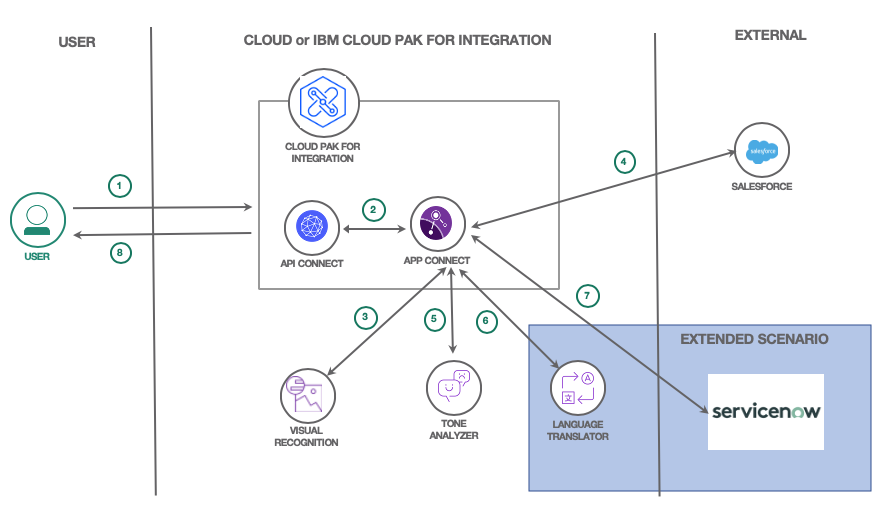

# API-led Application Integration
### Work-in-progress

Every enterprise in today's markets must offer robust digital products and services, often requiring integration of complex capabilities and systems to deliver one coherent whole. [IBM Cloud Pak for Integration](https://cloud.ibm.com/docs/cloud-pak-integration?topic=cloud-pak-integration-getting-started) offers a simplified solution to this integration challenge, allowing the enterprise to modernize its processes while positioning itself for future innovation. Once installed, IBM Cloud Pak for Integration eases monitoring, maintenance and upgrades, helping the enterprise stay ahead of the innovation curve.

In this Code Pattern will use the low-code/no-code Integration Designer to create an API which takes a car repair claim request, complete with a photograph of the car, and integrates with a SaaS CRM system and IBM’s Watson AI to create a car repair case with all the correct details loaded into the SaaS system. and data routed to the correct location based on the image contents; all in a few seconds before returning a response to the customer.

As an ‘extension’ we check if the car is a convertible/roadster.

 If it is, we translate the request into Spanish for our Spanish-speaking partner and create an incident their ServiceNow SaaS system, complete with car photograph.

 Due to time constraints, the ‘extension’ will only be briefly described – we will ensure we build an end-to-end managed API before discussing the extended scenario.

*This workshop may look long but don’t be put off by the sheer number of pages: Most of them are filled with screenshots and descriptions– there’s not that much “work” to actually do – we’ve created a lot of things for you to use ready-to-go.*

Business Scenario:	

- We are a Car Repair company: We take in vehicles with problems and repair them – seems simple but..

  - We want to gain business advantage by allowing multiple car leasing companies to use us to repair their cars – these companies insist that we expose APIs for them to call to do business with them.
  - We want to allow their customers to book their cars in for repair and get an estimate for price and number of days in real time – in seconds. Later we will build more APIs to allow customers to query the status of their repairs, or make updates or add comments to their repair cases.
  - We want to allow them to send photos of their cars so we can check for type, damage etc.
  - We want to check for errors and issues up-front as quickly as possible to feed back to the customer in real time. Photo not valid? No car in the photo? We’ll tell you instantly so you can re-submit.
  - We want to minimize manual processes and have the repair request automatically create a repair case in our CRM system (Salesforce). If a customer wants to book a repair at 3am on a Sunday, they can – it’s their choice.
  - We are wanting to grow our business fast with this new model and expect the use of APIs to really increase the number of requests we get. We need our solution to be scalable and highly available.

  

# Architecture

# Flow

1. User sends car repair request to API (API Connect)
2. User request is forwarded to integration flow
3. Use IBM Watson Image Recognition to analyze the photo. If it is not a valid picture, Watson will return an error immediately to the user calling the API. Check that Watson can ‘see’ a car in the picture – if not, we will immediately respond back with an error saying ‘There is no car in this picture’ so the error can be corrected immediately.
4. Create a `Case` in Salesforce with the data from the API. This Case is where we store the details and progress of our repair. Also, add an attachment of the photograph to Salesforce so that we have the image stored in our system.
5. Analyze the description of the problem as described by the customer using IBM Watson Tone Analysis. We store this in Salesforce for future reference – if the customer is angry or upset, we may wish to take further action or treat them more carefully.
6. This is an extended scenario, wherein if the car is a specialist car (identified by Visual Recognition Service) it is sent to partner for repair. The partner speaks Spanish and and we'll use IBM Watson language translator to translate our request into Spanish before we send it to them
7. This is an extended scenario as well. Partner uses ServiceNow, not Salesforce so we need to create an incident in their ServiceNow system – automatically
8. Send a response back to the customer with their Salesforce case reference for future enquiries and also an estimate of how long it will take to repair and how much it will cost.

# Watch the Video

We will achieve the above objectives in two parts as follows:

Part1 - In part1, we will build and deploy our integration application using App Connect in CP4I. [Build a Cognitive Car Claim Processing application with CP4I Integration capabilities]()

Part2 - In part2, we will expose the integration application APIs using API management feature of CP4I. [Use API Management capabilities of ICP4i to expose APIs to the wider world in a controlled manner]()

